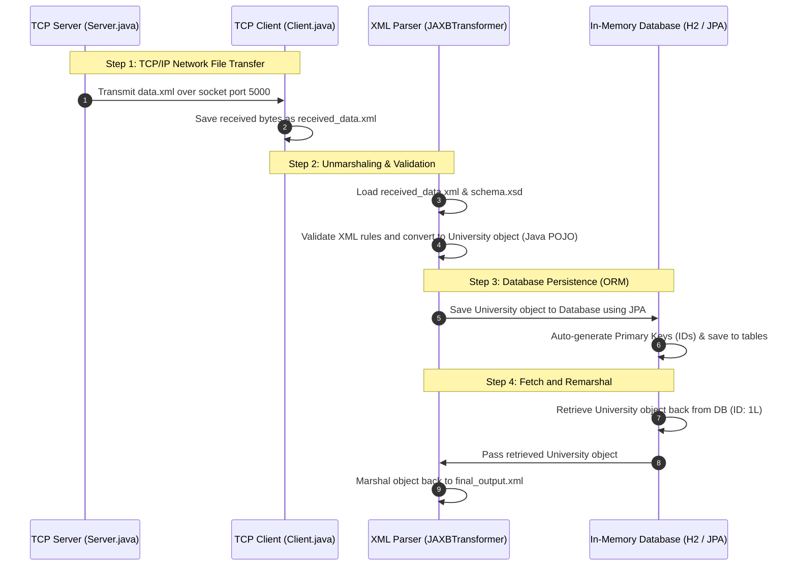

# Java Project Defense & Code Comprehension Guide

This guide is designed for developers or students defending this Java project with no prior background in Java. It breaks down the application's flow, explains the core technologies, and details every file, line of code, keyword, and annotation. 

---

## 1. High-Level Project Workflow

The application is a Spring Boot project that demonstrates automated file transfer, XML validation, object serialization (marshaling/unmarshaling), database persistence, and database retrieval.

Here is the exact lifecycle of the application:



---

## 2. Core Technologies Explained

Before looking at the code, it is important to understand the four core technologies used in this project:

### Maven & `pom.xml`
* **What is it?** Maven is a project management and build automation tool.
* **Why use it?** Instead of manually downloading Java `.jar` libraries from the internet and adding them to your project, you declare the dependencies you need in a file called `pom.xml`. Maven automatically downloads, updates, and compiles them for you.

### XML Serialization (Marshaling & Unmarshaling)
* **What is it?** 
  * **Unmarshaling**: Converting an XML text file into a Java Object in memory.
  * **Marshaling**: Converting a Java Object in memory back into an XML text file.
* **Why use it?** Computers need to transmit data. XML is a standard readable text format. Java objects only exist in RAM while the program is running. We marshal to save/send data, and unmarshal to load data.
* **JAXB (Jakarta XML Binding)** is the standard library used to do this in Java.

### XML Validation (DTD vs. XSD)
* **DTD (Document Type Definition)**: An older schema language. It only validates the structure (e.g., a `<student>` tag must contain `<name>`, `<visaType>`, and `<subjects>`). It **cannot** check data types (e.g., it cannot verify if `<credits>` is a number).
* **XSD (XML Schema Definition)**: A modern, XML-based schema language. It supports rich validation, including data types (e.g., `<credits>` must be a valid integer) and repetition constraints (e.g., elements can occur a maximum number of times).

### Databases & ORM (JPA & Hibernate)
* **ORM (Object-Relational Mapping)**: A technique that automatically maps Java classes to database tables, and Java object fields to database columns.
* **JPA (Jakarta Persistence API)**: A standard specification in Java that defines how ORM should work.
* **Hibernate**: The actual framework (provider) that implements JPA under the hood.
* **H2 Database**: An extremely lightweight, in-memory SQL database. It runs entirely in the computer's RAM. When the application starts, the database is created; when the application stops, the database is deleted. This is ideal for testing and classroom assignments.

---

## 3. Java Keyword & Syntax Reference

When presenting the code, you will encounter standard Java keywords. Here is a cheat sheet of what they mean:

| Keyword / Syntax | Meaning in Plain English |
| :--- | :--- |
| `package` | Declares which folder this file belongs to. Helps organize files and avoid naming conflicts. |
| `import` | Pulls in code written in other files or libraries so we can use them here. |
| `public` | Makes the class, method, or variable accessible from any other class in the project. |
| `private` | Restricts access so that only code *inside this specific class* can see or modify this variable. |
| `static` | Belongs to the class itself rather than an instance of the class. You can call it without using the `new` keyword. |
| `void` | Used on a method to indicate that it performs an action but does **not** return any output value. |
| `class` | The blueprint template used to create objects. |
| `interface` | A contract. It specifies *what* methods a class must implement, but not *how* they work. |
| `extends` | Inherits features from a parent class or interface (Inheritance). |
| `new` | Creates a new instance (object) of a class in RAM. |
| `this` | Refers to the current object instance inside a method or constructor. |
| `try-with-resources` | `try (Resource r = ...) { ... }` automatically closes the resource (like files or sockets) when done, preventing memory leaks. |
| `->` (Lambda) | A shortcut syntax to write anonymous functions (blocks of code that can be passed around). |

---

## 4. File-by-File Code & Annotation Breakdown

---

### [pom.xml](file:///Users/rahi/Downloads/FirstTask_MD_IMRAN_HASAN%202/pom.xml)

This is the Maven Configuration file. It defines the project's configurations and dependencies.

#### Key Configurations:
* **`spring-boot-starter-parent`** (Lines 5-10): A parent configuration that sets up default compiler settings, version management, and configurations for Spring Boot.
* **`java.version`** (Line 30): Sets the target Java version to 17.
* **`spring-boot-starter-data-jpa`** (Lines 37-40): Includes Hibernate and JDBC utilities to talk to databases.
* **`h2`** (Lines 42-46): The database driver for the in-memory H2 database.
* **`jakarta.xml.bind-api` & `jaxb-runtime`** (Lines 48-57): Libraries required to use JAXB (marshaling/unmarshaling) since modern Java (Java 9+) no longer includes JAXB by default.

---

### [AppApplication.java](file:///Users/rahi/Downloads/FirstTask_MD_IMRAN_HASAN%202/src/main/java/lt/viko/eif/i/hasan/app/AppApplication.java)

This is the main entry point of the Spring Boot application. It coordinates all the steps in sequence.

```java
@SpringBootApplication
public class AppApplication {
	public static void main(String[] args) {
		SpringApplication.run(AppApplication.class, args);
	}
    ...
```

#### Annotation Explanations:
1. **`@SpringBootApplication`** (Line 15):
   * **What it does**: Tells Spring Boot that this is the main class. It automatically enables configuration, auto-configuration (like setting up the database based on the classpath), and scans the project folders for Spring components.
   * **If it wasn't here**: We would have to write complex XML configuration files or manually annotate classes with `@Configuration`, `@EnableAutoConfiguration`, and `@ComponentScan` to set up the Spring framework.
2. **`@Bean`** (Line 22):
   * **What it does**: Tells Spring that the object returned by this method (`CommandLineRunner`) should be registered as a "Bean" in the Spring context (allowing Spring to manage its lifecycle and inject dependencies into it).
   * **If it wasn't here**: The `run` method would never execute automatically at startup, and Spring wouldn't inject the database repository into it.

#### Code Explanation (Line-by-Line):
* **Line 23**: `public CommandLineRunner run(UniversityRepository repository)` — Defines a method that returns a functional runner. Spring automatically looks up the `UniversityRepository` and passes it in (Dependency Injection).
* **Line 26**: `System.setProperty("javax.xml.accessExternalDTD", "all");` — Instructs the XML parser to allow external DTD files (`schema.dtd`) during validation. Without this, security defaults would block loading the local DTD file.
* **Line 31**: `new Thread(() -> Server.startServer()).start();` — Spins up a new background Thread to run the TCP server. We must run it in a separate thread because the server socket is *blocking* (it stops execution until a client connects). If run in the main thread, the program would freeze and never reach the client connection code.
* **Line 32**: `Thread.sleep(1000);` — Pauses the main thread for 1 second (1000 milliseconds) to give the server thread enough time to start up and listen on port 5000 before the client attempts to connect.
* **Line 35**: `Client.startClient();` — Connects to the server, downloads the file, and writes it locally as `received_data.xml`.
* **Line 38-42**: Initializes `JAXBTransformer` and converts `received_data.xml` into a `University` Java object (POJO) while validating it.
* **Line 47**: `repository.save(uni);` — Saves the entire `University` object graph (including nested `students` and their `subjects`) into the database. JPA handles the mapping and SQL generation under the hood.
* **Line 52**: `repository.findById(1L).orElseThrow();` — Queries the H2 database to find the record with ID `1` (type `Long`). If not found, throws an exception.
* **Line 58**: `transformer.transformToXML(dbUniversity, finalOutput);` — Marshals the retrieved object back into `final_output.xml` to verify database retrieval integrity.

---

### [Server.java](file:///Users/rahi/Downloads/FirstTask_MD_IMRAN_HASAN%202/src/main/java/lt/viko/eif/i/hasan/app/network/Server.java)

This class opens a network socket port and serves the `data.xml` file.

```java
public class Server {
    public static void startServer() {
        try (ServerSocket serverSocket = new ServerSocket(5000);
             Socket clientSocket = serverSocket.accept();
             FileInputStream fis = new FileInputStream("src/main/resources/data.xml");
             OutputStream os = clientSocket.getOutputStream()) {
             ...
```

#### Code Explanation (Line-by-Line):
* **Line 13**: `ServerSocket serverSocket = new ServerSocket(5000);` — Tells the operating system that this program wants to listen for incoming network connections on port `5000`.
* **Line 14**: `Socket clientSocket = serverSocket.accept();` — A blocking call. The server pauses here and waits until a client connects. Once a client connects, it returns a `Socket` object representing the connection.
* **Line 15**: `FileInputStream fis = new FileInputStream(...)` — Opens a file stream to read the contents of the local `data.xml` file.
* **Line 16**: `OutputStream os = clientSocket.getOutputStream()` — Obtains the output stream of the connected client socket. Writing to this stream sends bytes over the network.
* **Line 21-25**: Reads the XML file in blocks of 4096 bytes (using a byte array `buffer`) and immediately writes those bytes into the network stream.
* **If we didn't use Sockets**: We could use a web server (like Spring Boot's built-in Tomcat) and write a REST Controller (`@RestController`) to serve the file over HTTP, or simply load the file locally (though the goal of the task is to demonstrate network communication).

---

### [Client.java](file:///Users/rahi/Downloads/FirstTask_MD_IMRAN_HASAN%202/src/main/java/lt/viko/eif/i/hasan/app/network/Client.java)

This class connects to the Server to download the XML file.

```java
public class Client {
    public static void startClient() {
        try (Socket socket = new Socket("localhost", 5000);
             InputStream is = socket.getInputStream();
             FileOutputStream fos = new FileOutputStream("received_data.xml")) {
             ...
```

#### Code Explanation (Line-by-Line):
* **Line 13**: `Socket socket = new Socket("localhost", 5000);` — Connects to the server running on the same machine (`localhost`) listening on port `5000`.
* **Line 14**: `InputStream is = socket.getInputStream();` — Opens an input stream to read bytes sent from the server.
* **Line 15**: `FileOutputStream fos = new FileOutputStream("received_data.xml")` — Opens a file stream to save the incoming bytes to a local file named `received_data.xml`.
* **Line 20-24**: Reads the bytes from the network socket in blocks of 4096 bytes and writes them directly to `received_data.xml` until the server closes the connection (returns `-1`).

---

### [JAXBTransformer.java](file:///Users/rahi/Downloads/FirstTask_MD_IMRAN_HASAN%202/src/main/java/lt/viko/eif/i/hasan/app/transformer/JAXBTransformer.java)

This class converts XML to Java objects (Unmarshaling) and Java objects back to XML (Marshaling), while validating XML structure against the XSD Schema.

```java
public class JAXBTransformer {
    public void transformToXML(University university, File file) throws Exception {
        JAXBContext context = JAXBContext.newInstance(University.class);
        Marshaller marshaller = context.createMarshaller();
        marshaller.setProperty(Marshaller.JAXB_FORMATTED_OUTPUT, true);
        marshaller.marshal(university, file);
        marshaller.marshal(university, System.out);
    }
    ...
```

#### Code Explanation (Line-by-Line):
* **Line 15**: `JAXBContext context = JAXBContext.newInstance(University.class);` — Entry point to the JAXB API. It scans the `University` class and its nested fields to understand how to map them to XML elements.
* **Line 16**: `Marshaller marshaller = context.createMarshaller();` — Creates an object responsible for turning Java objects into XML.
* **Line 19**: `marshaller.setProperty(Marshaller.JAXB_FORMATTED_OUTPUT, true);` — Tells the XML writer to format the output with indentations and newlines. Without this, the entire XML would be written as a single line, making it hard to read.
* **Line 22**: `marshaller.marshal(university, file);` — Converts the Java `university` object into XML and saves it to the specified file.
* **Line 24**: `marshaller.marshal(university, System.out);` — Converts the Java object to XML and prints it directly to the console so you can see it run.
* **Line 29-31**: Unmarshalling setup. Creates an `Unmarshaller` to convert XML text files back to Java objects.
* **Line 34-36**: **XSD Validation setup**:
  * `SchemaFactory.newInstance(...)`: Creates a factory to read standard W3C XML Schema definitions.
  * `sf.newSchema(new File("src/main/resources/schema.xsd"))`: Loads the schema rules.
  * `unmarshaller.setSchema(schema)`: Connects the schema validation rules to the unmarshaller. If the incoming XML does not fit the schema (e.g. missing name, invalid format), parsing stops and throws an error.
* **Line 38**: `return (University) unmarshaller.unmarshal(file);` — Parses the XML file and returns the populated `University` object (casting the output from generic `Object` to `University`).

#### What if we didn't use JAXB?
* **Alternative**: We would have to use basic Java parsers like **DOM (Document Object Model)** or **SAX (Simple API for XML)**. We would have to manually read each node (e.g., `doc.getElementsByTagName("name").item(0).getTextContent()`) and write tedious code to map every value into Java constructors:
  ```java
  // Example of alternative DOM parsing (verbose and prone to errors):
  NodeList studentNodes = doc.getElementsByTagName("student");
  for (int i = 0; i < studentNodes.getLength(); i++) {
      Element studentEl = (Element) studentNodes.item(i);
      Student s = new Student();
      s.setName(studentEl.getElementsByTagName("name").item(0).getTextContent());
      // ... manually parse subjects
  }
  ```
  JAXB saves us hundreds of lines of code by using annotations.

---

### [University.java](file:///Users/rahi/Downloads/FirstTask_MD_IMRAN_HASAN%202/src/main/java/lt/viko/eif/i/hasan/app/model/University.java)

This is the top-level domain model (Entity) representing a university. It is mapped to both a database table and an XML structure.

```java
@Entity
@XmlRootElement(name = "university")
@XmlAccessorType(XmlAccessType.FIELD)
public class University {
    @Id
    @GeneratedValue(strategy = GenerationType.IDENTITY)
    @XmlTransient
    private Long id;

    private String name;

    @OneToMany(cascade = CascadeType.ALL, fetch = FetchType.EAGER)
    @JoinColumn(name = "university_id")
    @XmlElement(name = "student")
    private List<Student> students;
    ...
```

#### Annotation Explanations:
1. **`@Entity`**:
   * **What it does**: Tells JPA (Hibernate) that this class represents a database table named `UNIVERSITY`.
   * **If it wasn't here**: Hibernate would ignore this class, meaning you could not save it or retrieve it from the database using JPA. You would have to write raw JDBC SQL inserts yourself.
2. **`@XmlRootElement(name = "university")`**:
   * **What it does**: Tells JAXB that this class is the root element of the XML document, mapped to the `<university>` tag.
   * **If it wasn't here**: JAXB would fail with an exception during marshaling/unmarshaling, as it wouldn't know where the XML document begins.
3. **`@XmlAccessorType(XmlAccessType.FIELD)`**:
   * **What it does**: Instructs JAXB to read Java variables directly. By default, JAXB looks at getters and setters. Using field access is cleaner and less error-prone.
   * **If it wasn't here**: We would have to put JAXB annotations on top of the getter methods (`getName()`, `getStudents()`) instead of directly on the variables.
4. **`@Id`**:
   * **What it does**: Marks the `id` field as the primary key of the database table.
   * **If it wasn't here**: JPA will throw a compiler/runtime error, as database entities must have a unique identifier.
5. **`@GeneratedValue(strategy = GenerationType.IDENTITY)`**:
   * **What it does**: Tells the database to auto-generate the ID when saving (using an auto-incrementing column).
   * **If it wasn't here**: We would have to manually assign a unique ID (like a random number or counter) before saving the university object.
6. **`@XmlTransient`**:
   * **What it does**: Prevents this field from being serialized into XML.
   * **If it wasn't here**: The XML output would contain an `<id>` tag. Since database IDs are irrelevant to raw XML files transferred between systems, we hide it.
7. **`@OneToMany(cascade = CascadeType.ALL, fetch = FetchType.EAGER)`**:
   * **What it does**: Maps a one-to-many relationship in SQL (one university has multiple students).
     * `cascade = CascadeType.ALL`: Saves, updates, or deletes nested student objects automatically when the university is saved/updated/deleted.
     * `fetch = FetchType.EAGER`: Loads the students list immediately whenever you load the university from the database.
   * **If it wasn't here**: We would have to save each `Student` object separately in the database before saving the `University` object, and load them manually via custom database queries.
8. **`@JoinColumn(name = "university_id")`**:
   * **What it does**: Specifies the foreign key column name (`UNIVERSITY_ID`) in the child table (`STUDENT`) to establish the database relationship.
9. **`@XmlElement(name = "student")`**:
   * **What it does**: Maps the list elements inside Java (`List<Student> students`) to individual `<student>` XML tags.

#### Why is there an empty constructor `public University() {}` (Line 24)?
* **Why**: Java libraries like Hibernate (JPA) and JAXB use Java **Reflection** to dynamically create instances of classes at runtime. Reflection requires a no-argument constructor to create the empty object before injecting values into it. If we don't have it, the program will crash when trying to read from XML or the database.

---

### [Student.java](file:///Users/rahi/Downloads/FirstTask_MD_IMRAN_HASAN%202/src/main/java/lt/viko/eif/i/hasan/app/model/Student.java)

Represents a student. Follows the same patterns as `University.java`.

```java
@Entity
@XmlAccessorType(XmlAccessType.FIELD)
public class Student {
    @Id
    @GeneratedValue(strategy = GenerationType.IDENTITY)
    @XmlTransient
    private Long id;

    private String name;
    private String visaType;

    @OneToMany(cascade = CascadeType.ALL, fetch = FetchType.EAGER)
    @JoinColumn(name = "student_id")
    @XmlElementWrapper(name = "subjects")
    @XmlElement(name = "subject")
    private List<Subject> subjects;
    ...
```

#### New Annotations Explained:
1. **`@XmlElementWrapper(name = "subjects")`** (Line 23):
   * **What it does**: Wraps the XML list inside a parent XML tag named `<subjects>`.
   * **Visual Difference**:
     * **With Wrapper**:
       ```xml
       <subjects>
           <subject>...</subject>
           <subject>...</subject>
       </subjects>
       ```
     * **Without Wrapper**:
       ```xml
       <subject>...</subject>
       <subject>...</subject>
       ```
2. **`@XmlElement(name = "subject")`** (Line 24):
   * **What it does**: Overrides the XML element name. Instead of using the Java variable name (`subjects`), it names each individual element `<subject>`.

---

### [Subject.java](file:///Users/rahi/Downloads/FirstTask_MD_IMRAN_HASAN%202/src/main/java/lt/viko/eif/i/hasan/app/model/Subject.java)

Represents a subject taken by a student.

```java
@Entity
@XmlAccessorType(XmlAccessType.FIELD)
public class Subject {
    @Id
    @GeneratedValue(strategy = GenerationType.IDENTITY)
    @XmlTransient
    private Long id;

    private String name;
    private int credits;
    ...
```

* This class contains simple columns `name` (String) and `credits` (integer) which map automatically to DB columns and XML elements.

---

### [UniversityRepository.java](file:///Users/rahi/Downloads/FirstTask_MD_IMRAN_HASAN%202/src/main/java/lt/viko/eif/i/hasan/app/model/UniversityRepository.java)

Provides database access operations (CRUD).

```java
@Repository
public interface UniversityRepository extends JpaRepository<University, Long> {
}
```

#### Annotation & Keyword Explanations:
1. **`@Repository`**:
   * **What it does**: Tells Spring that this interface is a database repository. Spring handles exceptions thrown by the database and converts them into readable Spring exceptions.
2. **`extends JpaRepository<University, Long>`**:
   * **What it does**: Tells Spring Data JPA to generate the code for this interface at runtime. You get methods like `save()`, `findById()`, `findAll()`, and `deleteById()` automatically.
   * **Alternative**: Without this, you would have to write SQL queries manually inside a class:
     ```java
     // Raw JDBC database write (not recommended, extremely verbose)
     String sql = "INSERT INTO university (name) VALUES (?)";
     PreparedStatement ps = connection.prepareStatement(sql);
     ps.setString(1, university.getName());
     ps.executeUpdate();
     ```

---

### [AppApplicationTests.java](file:///Users/rahi/Downloads/FirstTask_MD_IMRAN_HASAN%202/src/test/java/lt/viko/eif/i/hasan/app/AppApplicationTests.java)

This is a unit test class used to verify that JAXB correctly reads and validates the XML files.

#### Key Elements:
* **`@SpringBootTest`** (Line 11): Tells Spring to boot up the application context so we can run integration tests using Spring configurations.
* **`@Test`** (Line 14): Identifies the method as a JUnit test runner.
* **`Assertions.assertNotNull(uni)`**: Checks that the XML parser returned a real object and not `null`. If it returns `null`, the test fails.
* **`Assertions.assertEquals("Vilnius Kolegija", uni.getName())`**: Asserts that the university name loaded from XML matches the expected string.

---

## 5. XML Schema & Validation Files

---

### [data.xml](file:///Users/rahi/Downloads/FirstTask_MD_IMRAN_HASAN%202/src/main/resources/data.xml)
This contains the raw data representing Vilnius Kolegija, Imran Hasan, and their subjects.
* **`<!DOCTYPE university SYSTEM "src/main/resources/schema.dtd">`** (Line 2): Links this XML to the local DTD validation schema file.

### [schema.dtd](file:///Users/rahi/Downloads/FirstTask_MD_IMRAN_HASAN%202/src/main/resources/schema.dtd)
A DTD schema that defines structural constraints.
* `<!ELEMENT university (name, student+)>`: A university tag must contain a name tag, followed by one or more (`+`) student tags.
* `(#PCDATA)`: Parsed Character Data (means it contains plain text).

### [schema.xsd](file:///Users/rahi/Downloads/FirstTask_MD_IMRAN_HASAN%202/src/main/resources/schema.xsd)
An XSD schema that defines structural and data type constraints.
* `<xs:element name="credits" type="xs:int"/>`: Specifies that credits must be an integer, preventing invalid text from being entered as credit values.

---

## 6. Teacher Defense Q&A Cheat Sheet

Prepare yourself for these likely questions during your defense:

> [!NOTE]
> **Q1: Why did you start the server in a new thread? (`new Thread(...)`)**
> * **Answer**: The server's socket listener (`serverSocket.accept()`) is *blocking*. It pauses the program execution until a client connects. If we ran it in the main thread, the program would stop right there and never reach the client connection code below it, causing a deadlock where the client never starts and the server waits forever. By using a background thread, the server starts listening while the main thread continues and launches the client.

> [!TIP]
> **Q2: Where is the database, and how does it save tables?**
> * **Answer**: We are using an in-memory SQL database called **H2**. It runs entirely in the computer's memory (RAM). When the program starts, Spring Boot Hibernate inspects our `@Entity` classes (`University`, `Student`, `Subject`), automatically creates the SQL tables, and saves the data. When the program ends, the H2 database is completely deleted.

> [!IMPORTANT]
> **Q3: What is the difference between DTD and XSD in your project?**
> * **Answer**: DTD is an older, simpler format used only to define the structure of XML elements. XSD is a modern, XML-based format that is much more powerful. XSD can enforce data types (like ensuring credits is an integer), check bounds, and is highly integrated with the JAXB parser to run validations automatically during unmarshaling.

> [!NOTE]
> **Q4: Why do your entities have an empty constructor `public EntityName() {}`?**
> * **Answer**: Libraries like JAXB (for XML) and Hibernate (for SQL Database) use **Reflection** to build objects dynamically. Reflection works by first instantiating an empty object using the default constructor, and then injecting the field values. If the empty constructor is missing, these libraries will throw a instantiation exception at runtime.

> [!WARNING]
> **Q5: Why is the `@XmlTransient` annotation used on the entity IDs?**
> * **Answer**: The `id` field is a database primary key auto-generated by the database (`@GeneratedValue`). It does not exist in the raw XML schema and is irrelevant for data interchange. We use `@XmlTransient` to hide it from the XML output when marshaling, ensuring our generated XML is clean and matches the schema rules.

> [!NOTE]
> **Q6: How could you perform ORM (Database storage) if you didn't use JPA/Hibernate?**
> * **Answer**: We would have to write raw **JDBC** (Java Database Connectivity) code. We would manually write SQL strings (e.g. `INSERT INTO student (name) VALUES (...)`), bind variables, execute the updates, manage open database connections, and map SQL result sets back into Java objects using loops. JPA automates all this boilerplates.
